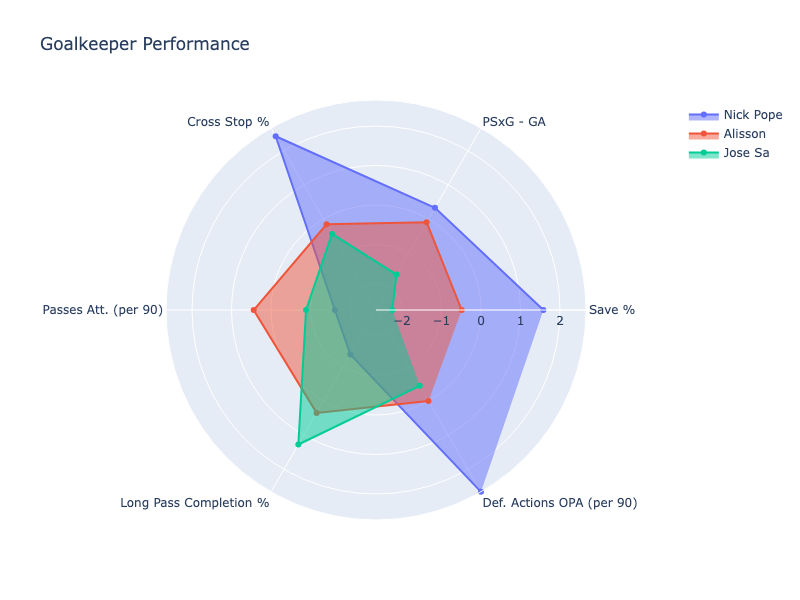

# Goalkeeper Performance Tracker

An end-to-end analytics platform to analyse the performance of goalkeepers in the English Premier League — built for fun and inspired by my passion for both goalkeeping and data engineering.

## Project Objective

In one sentence:

> **A lightweight, end-to-end goalkeeper analytics platform for the Premier League that demonstrates modern data engineering principles through a domain I deeply understand.**

More broadly, this project explores how a lightweight performance framework can be constructed for sports analytics use cases. Here, that framework is used to assess and compare the performance of Premier League goalkeepers.

## Scope & Constraints

This project uses goalkeeper match-level performance data from [FBRef.com](https://fbref.com/en/) as its primary data source. Due to the relatively small number of Premier League goalkeepers and the fixed match schedule, the resulting dataset is modest in size, with low data volume and low velocity by modern data engineering standards.

Scraping is throttled to comply with Sports-Reference’s published [bot-traffic limits](https://www.sports-reference.com/bot-traffic.html) (≈10 requests per minute), with conservative delays and backoff on rate-limit responses. The project is strictly non-commercial, does not compete with or substitute for Sports-Reference services, and does not use any collected data for training or supporting AI or machine-learning models, in accordance with the [Site Terms of Use](https://www.sports-reference.com/termsofuse.html).

All underlying data remains the property of Sports-Reference and its data providers; this project acknowledges and appreciates the availability of FBRef for personal use.

## Data Architecture

The data architecture for this project is intentionally simple and lightweight, and demonstrates the data engineering lifecycle—ingestion, transformation, and serving—on a small, low-velocity dataset. The platform follows a batch-oriented ELT pattern. Goalkeeper match data is scraped from FBRef, loaded into a local analytical database (DuckDB), transformed using dbt into curated analytical tables, and served via a lightweight web application. The entire pipeline is orchestrated locally using a Makefile to allow end-to-end or stepwise execution.

**Ingestion:** Data ingestion is handled via a Python-based web scraper using Selenium. A two-step approach is used:
1. Scraping a central “Premier League Goalkeepers” page to build a players manifest, and
2. Iterating over each goalkeeper’s match log URL to extract match-level performance data

The players manifest also stores metadata (e.g. last scraped date), illustrating how idempotency and incremental logic could be introduced in a more production-grade pipeline.

**Storage & Loading:** Raw match-level data is persisted locally and loaded into DuckDB, which serves as the project’s analytical database. DuckDB is well-suited to this use case because it is an OLAP-oriented engine designed for read-heavy, analytical SQL workloads, aligning with the project’s focus. It also offers native Python integration, enabling fast iteration while keeping the overall architecture simple.

**Transformation:** All transformations are handled exclusively in dbt, using a simple layered model structure (see below). Raw match logs are unified and parsed into clean, match-level staging models before being aggregated into fact tables representing goalkeeper performance across key dimensions (shot-stopping, distribution, sweeping, and crossing).

**Serving:** Curated analytical tables are exported and uploaded to a private Amazon S3 bucket, where they are consumed by a lightweight Flask-based web application (WIP). This separates analytical processing from presentation and mirrors common patterns used in production analytics systems.

Tooling choices were guided by fitness-for-purpose, with the aim of maximising clarity and iteration speed over architectural complexity. Given the low data volume, batch cadence, and stable schema, a simple data stack was most appropriate. The project illustrates how many real-world analytics problems can be solved cleanly with a small number of well-chosen tools, provided the underlying design is sound.

**Diagram:** TO ADD

## Data Modelling Approach

Data is modelled using a simple layered approach designed to minimise ambiguity with each layer having a clear, single responsibility. Given the project’s objective, the modelling approach prioritises analytics-ready data marts that support direct reads in the front end. For example, `fct_goalkeeper_performance` serves as the primary source of truth for goalkeeper performance metrics, while `mart_goalkeeper_league_ratings` builds on this foundation to compare goalkeepers relative to the league.

**Model layers:**

-	`stg_matchlogs_all`: All raw match log data from FBRef.com.
-	`stg_matchlogs_parsed`: Cleaned and parsed match-level goalkeeper data derived from match logs.
-	`fct_goalkeeper_performance`: Aggregated goalkeeper performance over all EPL matches.
-	`mart_goalkeeper_league_ratings`: Goalkeeper performance relative to other goalkeepers in the EPL.

## Goalkeeper Performance Framework

TO ADD

## Outputs & Intended Use

**Example:** Radar chart to compare three goalkeeper's performance.

TO ADD

## Current Status & Roadmap

TO ADD